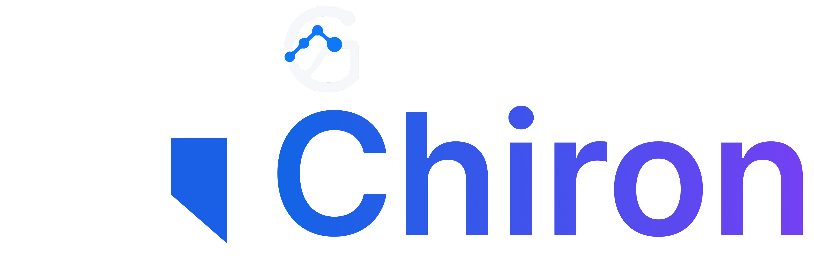
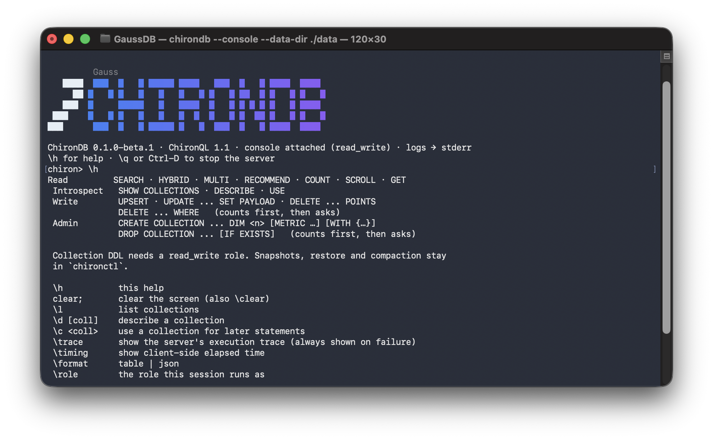
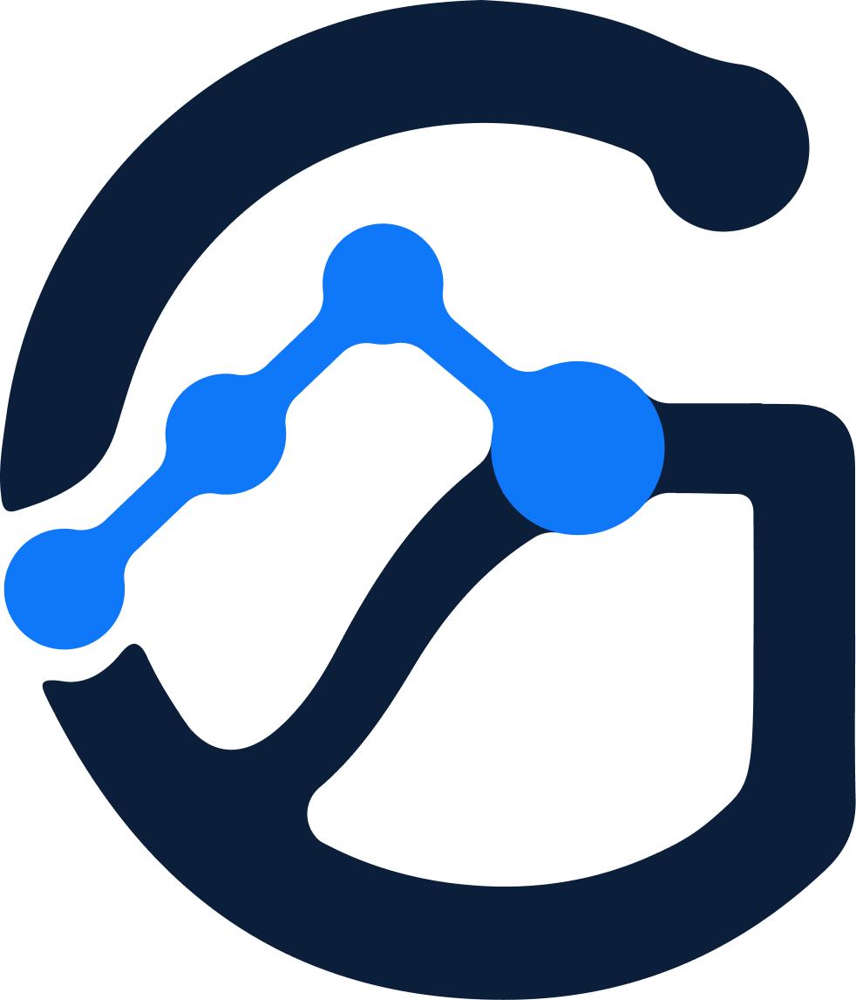

<p align="center">
  <a href="https://gaussian.id"></a>
</p>

<h1 align="center">ChironDB</h1>

<p align="center">
  <strong>Vector search, hybrid retrieval, and connected context. One Rust engine.</strong>
</p>

<p align="center">
  <a href="docs/releases/0.1.0-beta.1.md"></a>
  <a href="rust-toolchain.toml"></a>
  <a href="LICENSE"></a>
</p>

<p align="center">
  <a href="#quickstart">Quickstart</a> ·
  <a href="docs/GETTING_STARTED.md">Usage guide</a> ·
  <a href="docs/CHIRONQL.md">ChironQL</a> ·
  <a href="docs/HTTP_API.md">HTTP API</a> ·
  <a href="CONTRIBUTING.md">Contribute</a>
</p>

<br>

ChironDB is a self-hosted retrieval database for applications that need to find
relevant information and follow its relationships. Store embeddings and JSON
payloads, combine dense search with sparse BM25, and query through HTTP, gRPC,
ChironWire, read-only MCP tools, or an interactive ChironQL console.

A single LS-VEC engine manages dense retrieval. The beta also includes a
single-node property-graph overlay: points become vertices, typed edges connect
them, and graph constraints narrow dense or hybrid search. Your application
supplies the embeddings and handles generation; ChironDB stores and retrieves
the context.

When configured, the MCP interface lets AI applications discover authorized
collections, search them with native dense-plus-BM25 retrieval, and read a
selected point or chunk. MCP is disabled by default and requires API-key
authentication plus RBAC.

<p align="center">
  
  <br><sub>The ChironQL console, attached to the database process.</sub>
</p>

## Why ChironDB

- **Bring semantic and lexical retrieval together.** Dense vectors, sparse BM25,
  payload filters, and reciprocal rank or weighted fusion share one storage engine.
- **Search connected data.** Add typed relationships to existing points, traverse
  a bounded neighbourhood, or search within it using the beta graph overlay.
- **Keep retrieval quality visible.** Recall targets, drift monitoring, and audit
  records make retrieval quality something you can inspect. Validate recall
  targets on your own workload.
- **Use familiar interfaces.** Native HTTP and gRPC clients, ChironQL for terminal
  work, read-only MCP tools for AI applications, and a small pgvector-compatible
  PostgreSQL wire surface for vector queries.
- **Run it on your infrastructure.** A single Rust server for Linux and macOS,
  with x86-64 and ARM64 as the required platform targets.

## Status

The current source version is **`0.1.0-beta.1`**. ChironDB is under active beta
development; this is not a stable compatibility or uptime SLA. Start with a
source build. Tagged binary releases and prebuilt images should be used
only when their artifacts are available and verified.

Single-node use is the evaluation path. The graph overlay is implemented;
comprehensive graph acceptance remains open. Kubernetes and the web UI are
previews, and distributed graph traversal is outside the beta scope. Python
and Rust clients are distributed from source. The MCP surface is configuration
gated and read-only. Windows support is best-effort.

ChironDB complements PostgreSQL/pgvector for vector retrieval. Its PostgreSQL
wire surface accepts six vector-only SQL shapes; joins, CTEs, transactions,
and `CREATE INDEX … USING hnsw` return SQLSTATE `0A000`. ChironQL is a separate
retrieval language. See the [usage guide](docs/GETTING_STARTED.md#postgresql-and-pgvector-boundary)
for the supported boundary.

## Quickstart

Install Git, a C/C++ build toolchain, [Rust via rustup](https://rustup.rs), and
`protoc` (`brew install protobuf` on macOS, or
`sudo apt-get install build-essential protobuf-compiler` on Debian/Ubuntu).
The repository pins Rust `1.92.0`. On macOS, install the command-line
developer tools with `xcode-select --install` if needed. The examples also
use `curl`. If you already have a checkout, skip `git clone` and `cd`.

```bash
git clone https://github.com/Gaussian-id/ChironDB.git
cd ChironDB
cargo build --release --locked -p chirondb \
  --bin chirondb --bin chironql --bin chironmcp --bin chironctl
```

To use `chirondb --console` without the `./target/release/` prefix, follow
[command installation](docs/GETTING_STARTED.md#make-the-commands-available-in-new-terminals).

Start the server and its interactive console from the repository root:

```bash
./target/release/chirondb --console
```

The server stores data in `./data` and listens on loopback. This local
development example uses no authentication; see the
[security setup](docs/GETTING_STARTED.md#authentication-and-network-access)
before deploying remotely. If the default ports are occupied, connect to your
existing server with the client command below or follow the
[alternate-port setup](docs/GETTING_STARTED.md#1-build-and-start).

At the `chiron>` prompt, run one statement at a time. If `products` already
exists from this example, skip its creation.

```sql
CREATE COLLECTION products DIM 3 METRIC cosine;
UPSERT INTO products {id: 'phone', vector: [1,0,0], payload: {category: 'electronics', price: 699}};
UPSERT INTO products {id: 'book', vector: [0,0,1], payload: {category: 'media', price: 15}};
SEARCH products NEAR [1,0,0] WHERE category = 'electronics' LIMIT 5 WITH PAYLOAD;
```

The search returns `phone`. These three-dimensional vectors are demonstration
values; use embeddings from your model for real content.

Type `\h` for help or `\q` to stop the console and server. For a server that is
already running, use the separate client instead:

```bash
./target/release/chironql --url http://127.0.0.1:7401
```

| Interface | Default address | Guide |
| --- | --- | --- |
| HTTP REST | `127.0.0.1:7401` | [HTTP API](docs/HTTP_API.md) |
| MCP Streamable HTTP | `127.0.0.1:7401/v1/mcp` | [MCP clients](docs/SDKS.md#mcp-clients) |
| gRPC | `127.0.0.1:7402` | [gRPC API](docs/GRPC_API.md) |
| ChironWire / PostgreSQL subset | `127.0.0.1:7403` | [Compatibility boundary](docs/GETTING_STARTED.md#postgresql-and-pgvector-boundary) |

For Docker, HTTP requests, hybrid search, MCP, SDKs, and restart instructions, follow
[Getting started with ChironDB](docs/GETTING_STARTED.md).

## Documentation

| Start here | What it covers |
| --- | --- |
| [Getting started](docs/GETTING_STARTED.md) | Build, run, create a collection, and search |
| [ChironQL](docs/CHIRONQL.md) | Interactive queries, writes, graph traversal, filters, and errors |
| [HTTP API](docs/HTTP_API.md) | REST requests, authentication, graph operations, and administration |
| [gRPC API](docs/GRPC_API.md) | RPCs, reflection, TLS, and generated clients |
| [Python, Rust, and MCP clients](docs/SDKS.md) | Source installation, application examples, and MCP configuration |
| [Tenant isolation](docs/TENANT_ISOLATION.md) | Ownership, migration, and enforcement |
| [Beta release notes](docs/releases/0.1.0-beta.1.md) | Implemented graph surface and deliberate exclusions |

## Coming from GaussDB

ChironDB is the public name of the project previously called GaussDB. The beta
retains legacy command aliases, client imports, GaussWire frames, and the
`gaussdb.v1.GaussDb` gRPC service. `CHIRONDB_*` environment variables take
precedence over their `GAUSSDB_*` equivalents.

For upgrade instructions, see the
[usage guide](docs/GETTING_STARTED.md#upgrading-from-gaussdb).

## Contributing

Bug reports, documentation improvements, and focused pull requests are welcome.
Read [CONTRIBUTING.md](CONTRIBUTING.md) for the workflow and validation gates,
and [CODE_OF_CONDUCT.md](CODE_OF_CONDUCT.md) for community expectations.
Report vulnerabilities privately using [SECURITY.md](SECURITY.md).

## License

ChironDB is licensed under the **GNU Affero General Public License v3.0 only**
([AGPL-3.0-only](LICENSE)). If you modify ChironDB and let users interact with
that version over a network, Section 13 requires an offer of its Corresponding
Source. See [NOTICE](NOTICE) for source and historical licensing information.
[TRADEMARKS.md](TRADEMARKS.md) governs the names and brand assets separately.

<p align="center">
  <a href="https://gaussian.id"></a>
  <br>
  <sub>Built by <a href="https://gaussian.id">Gaussian</a> · <a href="https://www.linkedin.com/company/gaussian-id/posts/">LinkedIn</a></sub>
</p>
